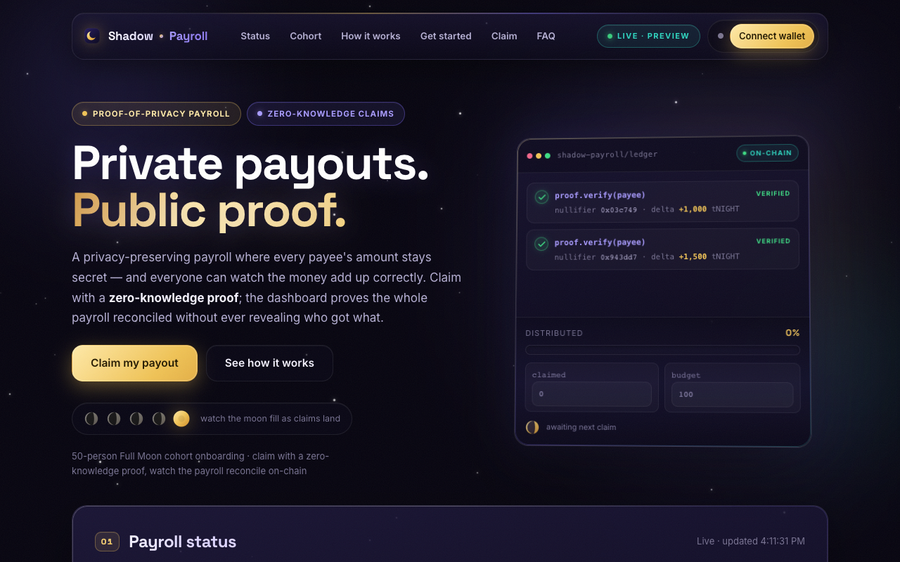

# Shadow Payroll

**Private payroll and revenue splits on [Midnight](https://midnight.network) — transparency without revealing who earns what.**

[](https://github.com/robertocarlous/Shadow-Payroll/actions/workflows/ci.yml)
[](https://x.com/shadowpayr)

> Privacy-preserving payouts, public proof. An employer commits a private
> payee allowlist as one Merkle root; every payee claims their allocation
> with a local zero-knowledge proof — nobody learns who is on the list,
> which entry is theirs, or what anyone else was paid.

## Live Demo

**https://shadow-payroll.vercel.app**

A wallet-connected audit dashboard with a real "Claim a payout" flow
(runs the proof locally, submits through Lace, watches the on-chain running
total move). See [docs/USAGE.md](docs/USAGE.md) for the step-by-step guide.

## Contract Address

| Network | Address | Status |
|---------|---------|--------|
| **Preprod** | *Target network — deploy pending Preprod indexer availability* | pending |
| **Preview** (live dashboard) | `157bc413f2b308b850ae340cc0f1c22951f9ea1c2079c25b9df622f04bc635fe` | live (redeployed 2026-09-21) |
| Preview (judge-testable) | `6f4a8a9565539e70605789e93f3a94966a4ce4c5670686fff0faf840cdeb7369` | live |
| Preview (first completed run) | `b1d5cdb3ce84d1cf44551302b2afa46fdce9df1ac51064b7c3d70bbc070902ee` | live |

> **Network note:** Preprod's indexer/wallet-sync path has failed repeatedly
> across this project's history (OOM crashes and indexer fall-behind that broke
> DUST fee validity — a confirmed Midnight infrastructure issue). The contract
> code is identical across networks; Preview is the verified working deployment.
> Preprod deployment is queued for when infrastructure stabilises — run
> `npm run setup -- --network preprod` to deploy.

## What This Product Does

A DAO, remote team, or contractor network can pay people on-chain without
leaking every salary to the public. Employers commit a **private payee
allowlist** as a single Merkle root; each payee **proves they're on it with a
local zero-knowledge proof** and claims exactly their own allocation. Nobody
else learns who is on the list, which entry is theirs, or what anyone else
was paid — while the on-chain running total still proves the payroll
reconciled to the last tNight.

When a DAO, remote team, or contractor network pays people on a public
blockchain, every salary and split becomes visible to anyone — competitors,
coworkers, the public. Teams that want on-chain transparency and auditability
end up sacrificing personal financial privacy to get it. Shadow Payroll
reverses that trade: **the payroll is fully auditable on-chain, but the
amounts themselves are private.** A Merkle root (one 32-byte hash) commits
the entire `{payee → amount}` list; claims reveal only a nullifier and a
delta on the public running total.

Midnight is the right home for this because it natively compiles
zero-knowledge proofs that run locally in the browser: the claiming side of
the privacy guarantee — proving membership in the allowlist *without
revealing which leaf* — is enforced by the smart contract, not by trusting a
server.

## Privacy Model

- **PUBLIC:** the single allowlist Merkle root, the declared total budget,
  and the running claimed total (so anyone can audit that the payroll
  reconciled). Each claim also publicly shows that *a* claim happened.
- **PRIVATE:** the whole payee list (who's eligible, and for how much), and
  which allowlist entry a given claim belongs to.
- **What the user PROVES without revealing:** that they are a member of the
  allowlist (Merkle path), that they haven't claimed before (nullifier
  derived from their secret), and that the payroll stays solvent — all in one
  zero-knowledge proof, without revealing *which* leaf or who they are.

In short: the amount claimed in a given transaction is visible as a number,
but **who** it belongs to is not (unlinkability). Fully hiding the amounts
from the public running total would need homomorphic commitments + ZK
range/sum proofs — a bigger lift explicitly out of scope for this MVP. See
[docs/ARCHITECTURE.md](docs/ARCHITECTURE.md).

## Tech Stack

- **Smart contract:** [Compact](https://docs.midnight.network)
  (`contracts/payroll.compact`) — Merkle root, nullifier, claim-expiration,
  and payee-removal ZK circuits
- **Backend:** TypeScript (`src/`) — off-chain Merkle allowlist builder,
  deploy/setup pipeline, interactive employer & payee CLI, wallet
  integration, contract-simulator test suite
- **Frontend:** React + Vite dashboard (`frontend/`) — read-only audit stats
  plus a wallet-connected claim flow (Lace wallet + local proof-server),
  credential preview before claiming
- **Infra:** Docker local devnet (node + indexer + proof-server), GitHub
  Actions CI

## Prerequisites

- **Node.js 22+** and npm
- **Docker Desktop** (for the local proof-server / devnet)
- **[Lace wallet](https://www.lace.io/)** connected to the **Preview**
  network, with a little tNight/DUST from the
  [Preview faucet](https://midnight-tmnight-preview.nethermind.dev)
- **[Compact toolchain](https://docs.midnight.network)** (pinned to
  `0.31.1`, see below)

## Setup & Run Locally

```bash
curl --proto '=https' --tlsv1.2 -LsSf \
  https://github.com/midnightntwrk/compact/releases/download/compact-v0.5.1/compact-installer.sh | sh
compact update 0.31.1    # pinned — contracts/payroll.compact declares pragma language_version 0.23
```

```bash
npm install
npm run compile          # compiles contracts/payroll.compact -> contracts/managed/payroll
npm test                 # contract simulator suite (24 tests)
```

**Local devnet quickstart** (node + indexer + proof-server, deploys to the
`undeployed` network):

```bash
npm run setup
```

**Deploy to a public network:**

```bash
npm run setup -- --network preview    # or --network preprod (when available)
```

The first run generates a fresh wallet seed and saves it (with the deployed
contract address) to `.midnight-state.json` — **never commit this file**. You
may be prompted to fund the wallet from the network faucet.

**Run a payroll end to end:**

```bash
npm run build-allowlist payroll-input.example.json   # writes .payroll/root.json + credentials/
npm run cli                                          # 1. Fund payroll → paste .payroll/root.json
# give each payee their credentials/<id>.json; then, as a payee:
npm run cli                                          # 2. Claim payout → paste your credential path
```

**Frontend dashboard:**

```bash
cd frontend
npm install
cp .env.example .env    # VITE_NETWORK=preview, VITE_CONTRACT_ADDRESS=<address>
npm run build && npm run preview
```

> **Dev-mode note:** `npm run dev` currently hits a Vite + wasm-bindgen
> ordering issue from `@midnight-ntwrk/onchain-runtime-v3`. The production
> path (`build && preview`, and the Vercel deployment) is unaffected — use
> that for local testing.

## Run Tests

```bash
npm test
```

24 tests against a contract simulator (no network/proof server needed):
initial state, allowlist-credential root verification, funding, a valid
claim, full reconciliation, double-claim rejection (nullifier reuse),
tampered-amount rejection, non-member rejection, claim-before-funding,
double-funding rejection, the solvency guard over-budget rejection,
claim-expiration (before/after deadline), and employer-side payee removal.

The full flow has also been verified against a real local devnet with real
ZK proofs (see [docs/ARCHITECTURE.md](docs/ARCHITECTURE.md)).

## CI/CD

`.github/workflows/ci.yml` runs on every push/PR to `main`: installs the
pinned Compact toolchain, compiles the contract (TS bindings + ZK circuits),
runs the full test suite, typechecks, and builds both the root package and
the frontend dashboard.

## Usage Guide

See [docs/USAGE.md](docs/USAGE.md) — a plain-English "Getting Started on
Preview" + "Your First Transaction" walkthrough for non-technical users.

## Feedback & Iterations

The feedback loop is **open**: report bugs or suggestions via GitHub issues,
or through the [user feedback form](https://docs.google.com/spreadsheets/d/1LeJv0qy7mZjlCg-Ub7vBJuRgfbs-mkhn/edit?gid=1346840953#gid=1346840953)
every payee is pointed to after claiming (49 responses collected so far).
Every entry gets a `new → triaged → shipped` lifecycle in the weekly triage.

- **[docs/FEEDBACK-LOOP.md](docs/FEEDBACK-LOOP.md)** — how the loop works
- **[docs/FEEDBACK.md](docs/FEEDBACK.md)** — Level 6 changelog
- **[docs/level5/FEEDBACK.md](docs/level5/FEEDBACK.md)** — Level 5 changelog

Top changes made from user feedback:

- **First-run guide** — onboarding checklist + FAQ on the dashboard so new
  users know exactly what to do first (L5 Feedback #1)
- **A feedback channel you can actually find** — GitHub-issue loop with a
  public changelog (L5 Feedback #2)
- **Credential preview before claiming** — paste your credential and the
  dashboard tells you which payee + how much *before* submitting, so an
  ambiguous "claim failed" is far less likely (L6)
- **A self-service user guide** — `docs/USAGE.md` consolidates setup and
  claiming into one plain-English walkthrough (L6)

## Level 6 Users

Tracked live in a [Google Sheet](https://docs.google.com/spreadsheets/d/1LeJv0qy7mZjlCg-Ub7vBJuRgfbs-mkhn/edit?gid=1346840953#gid=1346840953) —
every payee's wallet address, captured alongside their feedback after
claiming (~40 unique verified respondents; see [LAUNCH_USERS.md](LAUNCH_USERS.md)
for the data-quality note). The 50-user Level 5 cohort is in [USERS.md](USERS.md).

## Community & Submission Maps

- Level 5 submission map: [docs/LEVEL5.md](docs/LEVEL5.md)
- Level 6 submission map: [docs/LEVEL6.md](docs/LEVEL6.md)

## Public Network Deployment Status

Live on Midnight **Preview**, redeployed **2026-09-21**: contract deployed
and payroll funded (budget 100) with real transactions, both confirmed
on-chain. Claims against this round are open and awaiting payees — track
progress via the contract address above or the live dashboard.

This redeploy also shipped two small contract features: employer-only
`extendDeadline` (push the claim window later without redeploying) and a
`pauseClaims`/`unpauseClaims` circuit breaker (freeze new claims to respond
to an issue, without touching claims already made). See
[contracts/DEPLOYMENTS.md](contracts/DEPLOYMENTS.md) for what changed.

Full deployment history, including how to independently verify each
entry on-chain: [docs/DEPLOYMENTS.md](docs/DEPLOYMENTS.md).



**Preprod status:** Preprod's indexer/wallet-sync path has failed repeatedly
across this project's history (OOM crashes and indexer fall-behind that broke
DUST fee validity — a confirmed Midnight infrastructure issue, not a client
bug). Preview was used as the documented identical-code-path substitution.
Preprod deployment is queued for when infrastructure stabilises. See
[docs/LEVEL5.md](docs/LEVEL5.md) for the full history.

## Brand & Social

- **X / Twitter:** [@shadowpayr](https://x.com/shadowpayr)
- **Tagline:** Private payouts, public proof.
- **Brand brief:** [docs/BRAND-BRIEF.md](docs/BRAND-BRIEF.md) — colour palette, key messages, banner concept
- **Dashboard screenshots:** [docs/screenshots/](docs/screenshots/)

## License

Apache License 2.0 — see [LICENSE](LICENSE).